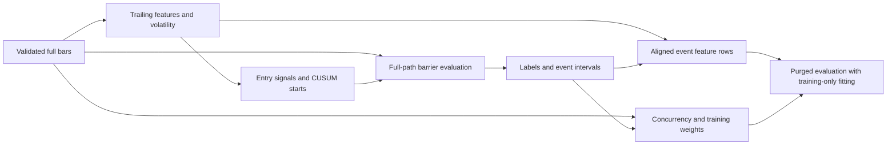

# Data preprocessing pipeline analysis

## Conclusion

The project implements an educational, event-driven preprocessing workflow across notebooks: market observations → activity bars → signals/features → CUSUM event selection → triple-barrier labels → overlap-aware sampling/weights → model evaluation. `cqrlib` supplies most computations; the notebooks orchestrate them and sometimes duplicate implementations.

The main limitation is correctness, not missing algorithms. The current triple-barrier implementation removes intermediate prices before testing barriers. Features and event thresholds can incorporate the test period, and the available purged splitter is incorrect. Consequently, successful notebook execution and stored classification scores do not establish a reliable out-of-sample experiment.

In a controlled price-path comparison, retaining all prices changed **91 of 1,458 shared labels (6.24%)** for `dollar_bars.csv`, and **25 of 292 (8.56%)** for `dollar_bars.txt`. Repair labeling and temporal isolation before interpreting model comparisons or tuning classifiers.

## Scope and evidence

- Reviewed the current AFML working tree, based on commit `6da6d7e`, and the supplied sibling `cqrlib` checkout, commit `79f363a`. Existing notebook edits were included in the analysis and preserved. The dependency checkout was clean when inspected.
- Focused on chapters 2–7 and the acquisition/diagnostic scripts. Later portfolio, backtest, and synthetic classification exercises are not one continuous preprocessing pipeline.
- Used `.github/instructions/delivery-workflow.instruction.md` as the plan → execute → validate → conclude guide. This task is an analysis: recommended repairs below were not applied.
- Executed local data audits, deterministic counterexamples, representative preprocessing cells, and one-factor labeling comparisons. No market-data downloads, full notebook suite, model grid searches, or trading-performance evaluation were performed.
- Honored `.python-version` (`mlquant`): Python 3.12.4, pandas 3.0.5, NumPy 2.4.6, scikit-learn 1.9.0, statsmodels 0.14.6, numba 0.66.0. The installed `cqrlib` resolved to the supplied checkout. Commands used `pyenv exec python`; `MPLCONFIGDIR` pointed to temporary writable storage.

Notebook cell references below are **one-based positions, including markdown cells**. Library references are relative to the sibling checkout; its source root is `../cqrlib/cqrlib/` from AFML's root. Line numbers describe the inspected revision.

## Where the pipeline lives

| Entry point | Role and actual behavior |
|---|---|
| [Download script](../../AFML/scripts/download_binance_tick.py) | Downloads daily aggregate trades, parses timestamps, computes price × quantity, constructs three bar types, and writes `.txt` files. |
| [AFML 2.1](../../AFML/exercises/AFML%202.1.ipynb), [2.1.1](../../AFML/exercises/AFML%202.1.1.ipynb) | Compare existing bars and demonstrate synthetic data/activity sampling. The local `dd_bars` example selects threshold-crossing rows; it does not construct OHLCV aggregates. |
| [AFML 3.1](../../AFML/exercises/AFML%203.1.ipynb) | Legacy `.csv` close → daily volatility → price-scale CUSUM → one-day vertical barrier → `[1,1]` barriers without side → signed-return labels and optional rare-label removal. |
| [AFML 3.2.1](../../AFML/exercises/AFML%203.2.1%20-%20Triple%20Barrier%20Labeling.ipynb) | Fixed-fraction EMA bands → contrarian side → CUSUM → `[0,2]` barriers with side → profitability labels. |
| [AFML 3.2.2](../../AFML/exercises/AFML%203.2.2%20-%20Meta-Labeling%20with%20sklearn.ipynb) | Rebuilds labels/features, fits a secondary random forest, compares side rules and parameters, and tunes using `TimeSeriesSplit`. |
| [Primary model only](../../AFML/exercises/AFML%203.2.2b%20-%20Primary%20Model%20Only.ipynb) | Similar side-filtered feature construction, but calls labeling with `side=None`; the input still contains band-derived side/features. |
| [AFML 4.1](../../AFML/exercises/AFML%204.1.ipynb), [4.2](../../AFML/exercises/AFML%204.2.ipynb), [4.3](../../AFML/exercises/AFML%204.3.ipynb) | Concurrency, uniqueness, class weights, time decay, indicator matrices, and sequential bootstrap. 4.1 uses `.csv`; 4.2–4.3 use `.txt`. |
| [AFML 5.1](../../AFML/exercises/AFML%205.1.ipynb), [5.2](../../AFML/exercises/AFML%205.2.ipynb) | Local fractional-differencing implementations and stationarity experiments. |
| [AFML 5.3](../../AFML/exercises/AFML%205.3.ipynb), [5.4](../../AFML/exercises/AFML%205.4.ipynb), [6.1](../../AFML/exercises/AFML%206.1.ipynb), [7.1](../../AFML/exercises/AFML%207.1.ipynb) | Cumulative log-price → FFD → CUSUM → event-only frame → five-day labels → bagging/weights/CV. |

There is no shared preprocessing entry point or persisted, versioned feature/label artifact connecting these notebooks. Each notebook reconstructs its own variant. The sklearn `Pipeline` in 3.2.2 cell 20 contains only the classifier: it does not bring the earlier feature fitting into cross-validation.

## Inputs and data contracts

### Two distinct bar datasets

All six main bar files loaded successfully. They contain no missing cells, have increasing unique timestamps, and satisfy basic OHLC bounds (`low ≤ open/close ≤ high`). These checks cannot establish that aggregates match the original trades.

| File in `sample-data/` | Rows | First timestamp | Last timestamp | Activity columns |
|---|---:|---|---|---|
| `dollar_bars.csv` | 24,079 | 2015-01-01 23:00:23.723 | 2016-12-30 21:13:31.990 | `cum_vol`, `cum_dollar`, `cum_ticks` |
| `volume_bars.csv` | 29,023 | 2015-01-01 23:00:00.059 | 2016-12-30 21:08:56.323 | Same legacy names |
| `tick_bars.csv` | 41,123 | 2015-01-01 23:16:58.834 | 2016-12-30 21:08:09.245 | Same legacy names |
| `dollar_bars.txt` | 4,988 | 2024-01-01 00:10:32.551 | 2024-02-04 23:36:38.584 | `volume`, `dollar_value`, `ticks_count` |
| `volume_bars.txt` | 4,991 | 2024-01-01 00:10:09.270 | 2024-02-04 23:46:51.160 | Same newer names |
| `tick_bars.txt` | 4,527 | 2024-01-01 00:11:46.210 | 2024-02-04 23:38:12.918 | Same newer names |

Each `*_bars copy.txt` is byte-identical to its corresponding `.csv`. The ordinary `.txt` files are different data, not alternate extensions of the legacy samples. The acquisition script is configured for BTCUSDT, January 1–February 4, 2024, with thresholds of 10,000 aggregate-trade rows, 300 quantity units, and 13,000,000 quote-value units. The observed `.txt` date range matches that configuration, but raw archives/provenance manifests were not available to verify reconstruction. The legacy files' market/source cannot be established from their schema alone.

`imbalance_bars_3_100000.csv` additionally contains 50,000 rows and **11,589 duplicate timestamps**. It is not a main input to the reviewed labeling notebooks, but cannot safely enter their timestamp-keyed operations without an explicit duplicate policy.

Parsed timestamps are timezone-naive `datetime64[us]` in this environment. Current `vol`, `vert_barrier`, and `tri_barrier` passed the baseline checks at that resolution; old comments claiming every `cqrlib` call requires nanoseconds are too broad for this revision. Timezone meaning still needs an explicit data contract.

### Stage semantics

1. **Acquisition and activity bars.** The downloader counts aggregate-trade records as ticks, not individual underlying executions. It assumes a fixed headerless schema and millisecond timestamps. Its main loop skips failed days and continues, so output coverage is not guaranteed by the configured date range. Paths depend on running scripts from the repository root and notebooks from `exercises/`.
2. **Indicators and sides.** `Util/indicator.py` computes trailing EMA bands. `bband_frac` uses EMA × width; its returned `std` is a price-fraction distance, not an estimated standard deviation. `bband_std` uses EWM standard deviation and a multiplier. `side_pick` marks each upper-band touch −1 and lower-band touch +1; other rows remain NaN. Subsequent `dropna()` removes them. `bband_as_side` combines these steps and returns the reduced frame. MA-cross variants retain only crossing timestamps.
3. **Volatility.** `Util/volatility.py:32–36` computes simple returns against a historical observation near the requested calendar lag and applies EWM standard deviation. `span0=50` is 50 return observations, not 50 calendar days. The initial lag and standard-deviation warm-up remove coverage. The lookup uses the observation strictly before the lag boundary; on exactly daily data, the default therefore compares against two days earlier.
4. **Features.** Chapter 3.2 adds close, band values, side, volatility, log price/return, a differentiated series, and ARIMA residuals. Chapter 5 onward uses a different transform and frequently keeps only close, FFD, and volatility. These feature definitions are not interchangeable.
5. **CUSUM.** `Filters/filters.py:73–81` accumulates positive/negative differences and emits timestamps when a scalar limit is reached. The threshold must use the same units as the input differences. Current price-based notebooks generally use `mean(volatility) × mean(close)`, correcting the earlier return/price mismatch. This is still a full-sample estimate. A Series limit is collapsed to its mean, so this API does not implement adaptive time-varying thresholds. The filter itself does not test or guarantee stationarity or constant variance.
6. **Barriers and labels.** `vert_barrier` picks the first available observation at/after an elapsed calendar horizon. `tri_barrier` retains targets strictly greater than `min_req`, checks profit/stop thresholds, and returns event metadata indexed by entry time. End-of-data events lack a complete vertical horizon; they survive only if another exit is found. `meta_label` produces realized-return sign without side, or 0/1 profitability after multiplying by side. No fees or execution costs are subtracted; `min_req` is an event eligibility threshold.
7. **Weights and sampling.** `Sampling/sample_unique.py` counts active intervals inclusively over `[entry,t1]`, averages reciprocal concurrency, builds a bar-by-event indicator matrix, and supports uniqueness-based bootstrap, return attribution, and time decay. These depend on correct exit times and the observation calendar. Chapter 5.4 temporarily stores `wr`/`wt` in `X` for alignment and removes them before fitting; they are training weights, not predictors.
8. **Model input.** Most notebooks reindex features to the retained label timestamps. That must be followed by a shared finite-row mask for features, labels, metadata, and weights: calling `dropna` before `reindex` can reintroduce missing rows. Chronological splitting by entry time alone does not isolate forward-looking label intervals.

## Findings ranked by impact

### 1. Critical: barrier evaluation loses the price path

**Source:** `Labels/triple_barrier_method.py:126`, then `_pt_sl_t1` at lines 35–39; additionally 3.2.2 cells 3/10 and 5.3–5.4 cells 8–11 reduce the input before labeling.

`tri_barrier` explicitly replaces the supplied full price series with prices at CUSUM event timestamps. Intermediate closes disappear. A real horizontal-barrier crossing can then be missed, or detected late. The vertical exit can be a timestamp absent from the reduced path, while `meta_label` later values it against a different input series.

**Reproduced counterexample:** daily closes `[100,120,100,100]`, event starts on days 1, 3, and 4, target 10%, barriers `[1,1]`, vertical exit day 4. The first event should take profit on day 2; the implementation returns day 4. This happens even when the caller passes all four prices.

**Required correction:** use event timestamps only to select entries. Retain the full bar close series for barrier detection, volatility estimation, exit valuation, and concurrency. Both the notebook reductions and the internal library reindex need attention.

### 2. Critical: test-period information enters preprocessing and training labels

**Source:** 3.2.2 cells 11, 13, 18, 20; primary-only cells 8, 10–11; 5.3 cells 6, 18; 7.1 cells 4–9.

- ARIMA models are fitted on the complete feature series before the split. Even their early residuals depend on parameters estimated with later observations.
- CUSUM limits use full-sample price/volatility means or FFD standard deviation. `fracdiff_side` also estimates its signal scale from the full series.
- Several notebooks randomly shuffle overlapping forward-return labels; the chronological variants do not purge labels that extend across the split.
- `TimeSeriesSplit` in 3.2.2 orders entry times, but has no event-horizon purge here. Its claim to have the same protection as purged CV is incorrect. Repeated side-rule/threshold selection against the same holdout also compromises its role as a final untouched test set.

**Measured:** chapter 4.2 preprocessing reproduced 256 labels; at its 70/30 chronological boundary, **five training events have `t1` at or after the first test entry**, `2024-01-17 12:36:39.350`. Matching the stored label distribution therefore does not establish temporal isolation.

**Required correction:** fit learned preprocessing only on training history, freeze or update it causally, retain each event's information interval, and purge interval overlap at both holdout and CV boundaries. Fit any feature-selection/FFD-order search inside the training procedure as well.

### 3. High: the existing purged splitter cannot provide that protection

**Source:** `Tools/cross_validate.py:105` uses integer label lookup on a datetime-indexed Series and defines the purge interval using the first test event's end and last test event's end. Lines 48 and 108–111 implement embargo via an aligned Series slice that removes the wrong retained positions.

**Reproduced:** six daily starts, each ending two days later, three folds: datetime-indexed input raises `KeyError: np.int64(0)`. With integer starts `0…5` and ends `[2,3,4,5,6,7]`, fold 2 retains training starts `[0,1]` against test starts `[2,3]`, despite interval overlap. With embargo `1/6`, fold 1 retains start 4 and removes 5; a one-observation embargo after the maximum test horizon 3 should do the opposite.

**Required correction:** use positional selection explicitly, derive overlap from actual entry/end intervals, and embargo after the test information horizon. Assert disjoint train/test information intervals; switching to `TimeSeriesSplit` alone is insufficient.

### 4. High: standard-bar construction has boundary defects

**Source:** [download script](../../AFML/scripts/download_binance_tick.py), lines 47–71.

The final `reduceat` group extends to the end of the raw array, although the last completed bar may end earlier. Its high/low/volume/value can include unfinished trailing trades while its timestamp, close, and tick count stop at the completion boundary.

**Reproduced:** prices `[10,11,12,13,99]`, quantities all 1, tick threshold 2. The second completed bar should have high 13, volume 2, and value 25; actual output has **high 99, volume 3, value 124**, but still close 13 and tick count 2.

Repeated threshold crossings within one large trade produce duplicate boundary indexes and empty/reversed groups. Prices `[10,20]`, quantities `[1,35]`, volume threshold 10 raise `IndexError`. Global cumulative thresholds also carry residual activity across boundaries, unlike a reset-after-crossing algorithm; some bars can therefore have activity below the nominal threshold. This convention must be intentional and documented.

The library's `Data_structure/standard_bars.py` is a separate implementation: it selects crossing source rows rather than aggregating OHLCV, expects uppercase `DV`/`V`/`Close`, and `tick_bar` sums `Close` rather than counting ticks. It is not a compatible replacement for the downloader.

**Required correction:** define indivisible-trade versus split-trade behavior and residual handling, cap every aggregation at its actual end, and test oversized trades, partial tails, empty inputs, and invalid thresholds. Then regenerate affected artifacts from verified raw input. Existing OHLC sanity checks do not detect the demonstrated tail error.

### 5. High: label behavior differs from notebook explanations

**Source:** `Labels/triple_barrier_method.py:132`, `:275–285`, and `drop_label`; primary-only cell 10.

- With `side=None`, `[pt,sl]` is replaced by `[pt,pt]`. Thus primary-only `[0,2]` disables both horizontal barriers. A test path `[100,70,100,100]`, 10% target, and day-4 vertical exit returns day 4 instead of stopping at day 2. Symmetric `[1,1]` and `[2,2]` calls are unaffected by this asymmetry issue.
- `meta_label` does not identify the exit barrier. A profitable vertical exit is labeled 1 with side, not automatically 0. Without side, labels are the sign of return, including zero only for a zero return.
- `drop_label` removes a sufficiently rare class only while at least three classes remain. `drop=0.05` does not mean “drop all vertical exits” and does not rebalance binary labels.

**Required correction:** make the no-side symmetry convention explicit or honor both parameters; preserve an exit-reason field if barrier identity matters; update notebook explanations to match the selected target definition. The primary-only versus meta-label comparison currently changes target semantics as well as model structure.

### 6. High for execution: incomplete API migration

| Location | Observed or source-confirmed issue | Consequence |
|---|---|---|
| 5.1 cell 7, local function in cell 6 | Executed failure: `fillna(method='ffill')` raises `TypeError` under pandas 3.0.5. The local FFD function in cell 10 has the same pattern. | Cannot execute this notebook from a fresh kernel as written. |
| 5.3 cell 6; same input pattern in 5.4, 6.1, 7.1 | Executed 5.3 failure: one-column DataFrame passed to `cs_filter` raises “truth value of a Series is ambiguous.” | Pass the intended numeric Series explicitly; preceding FFD computation succeeds. |
| `Features/fractional_diff.py:111` | Source still uses removed `Series.append` in `min_value`. | Library parameter search needs migration before use; not a failure of the working core FFD routine. |
| 5.3 cell 17 | Source imports `sklearn.ensemble.bagging`; other older calls use `base_estimator`. | Additional compatibility work is required beyond the first preprocessing failure; this review did not run the downstream training path. |

The library FFD routine accesses `.columns` and requires a DataFrame despite its Series annotation. In contrast, CUSUM needs a Series. Normalize these interfaces rather than relying on implicit one-column coercion.

### 7. Medium: fractional-differencing experiments represent different features

**Source:** 3.2.2 cell 9 versus 5.3–5.4 cell 3; `Features/fractional_diff.py:41–75`.

With `d=1.99999889`, threshold `1e-5`, the actual oldest-to-newest FFD coefficients are `[0.9999983350006162, -1.99999889, 1.0]`: essentially a three-point second difference.

- Chapter 3.2 applies it to **log-price differences**, approximately a third difference of log price overall.
- Chapters 5.3 onward apply it to **cumulative log price**, approximately a first difference of log price overall.

These are materially different transformations. The variable name `cs_log` in chapter 3.2 does not indicate a cumulative sum in the actual code. FFD itself is trailing with fixed parameters, but full-sample order/threshold selection is not causally isolated. A smaller ADF p-value alone does not quantify retained memory or predictive value.

### 8. Medium: alignment and sampling need explicit contracts

`dropna()` across all columns can remove otherwise usable observations; `drop_duplicates()` on feature values can remove distinct timestamps with identical features. Row-loss reasons are not recorded. Dataset changes also alter retained features: current 4.2 drops OHLC but leaves the newer activity columns, while chapter 3.2 explicitly drops legacy `cum_*` columns.

`mp_idx_matrix` mutates input via `dropna(inplace=True)` and documents `num_threads=1` as required. Its dense matrix scales with bars × events; reduced-price shortcuts change the meaning of uniqueness rather than merely reducing memory. Return weights require a DataFrame with lowercase `close`. Keep weights and event metadata aligned by timestamp and calculate training weights using the intended training event universe.

## Validation results

### Current baseline, without side

For each dollar-bar file: `vol(span0=50)` → `cs_filter(limit=vol.mean()*close.mean())` → one-day `vert_barrier` → `tri_barrier(min_req=0.002, ptSl=[1,1], num_threads=1)` → `meta_label(drop=False)`.

| Metric | Legacy `.csv` | Newer `.txt` |
|---|---:|---:|
| Input bars | 24,079 | 4,988 |
| Non-null volatility observations | 24,038 | 4,893 |
| Mean volatility | 0.00552005 | 0.01049690 |
| CUSUM events | 1,485 | 299 |
| Available vertical barriers | 1,483 | 296 |
| Retained labels | 1,458 | 292 |
| Positive / negative / zero | 774 / 677 / 7 | 141 / 151 / 0 |

As a unit-mismatch diagnostic, using the unscaled return-volatility mean against legacy price differences yields **22,890 events**, versus 1,485 with the price-scaled threshold. This measures event density, not stationarity or model quality.

### One-factor price-path comparison

**Hypothesis:** the internal event-only price path changes exits and labels. **Baseline:** the current calls above. **Variant:** preserve the same CUSUM events, targets, `min_req`, barriers, and vertical endpoints, but call `_pt_sl_t1` on the full close series and consolidate exit times identically. The procedure is deterministic and uses one process; no model or random seed is involved.

| Metric | Legacy `.csv` | Newer `.txt` |
|---|---:|---:|
| Baseline retained events | 1,458 | 292 |
| Full-path retained events | 1,459 | 293 |
| Shared events | 1,458 | 292 |
| Shared events with changed exit time | 791 | 182 |
| Shared events with changed label | 91 | 25 |

The extra retained event in each variant can arise because a horizontal touch is visible near the dataset tail even without a complete vertical horizon. The comparison isolates price-path retention; it does not claim the variant fixes all labeling or evaluation concerns.

To reproduce from AFML's root in the pinned environment, run the following Python body using `pyenv exec python`:

```python
import pandas as pd
import cqrlib as rs
from cqrlib.Labels.triple_barrier_method import _pt_sl_t1

for suffix in ('csv', 'txt'):
    close = pd.read_csv(f'sample-data/dollar_bars.{suffix}',
                        index_col='date_time', parse_dates=True)['close']
    vol = rs.vol(close, span0=50)
    starts = rs.cs_filter(close, vol.mean() * close.mean())
    vertical = rs.vert_barrier(close, starts, period='days', freq=1)
    baseline = rs.tri_barrier(close, starts, vol, 0.002,
                              num_threads=1, ptSl=[1, 1], t1=vertical)
    target = vol.reindex(starts)
    target = target[target > 0.002]
    metadata = pd.concat({'t1': vertical, 'trgt': target,
                          'side': pd.Series(1., index=target.index)},
                         axis=1).dropna(subset=['trgt'])
    touches = _pt_sl_t1(close, metadata, [1, 1], metadata.index)
    variant = metadata.drop(columns='side')
    variant['t1'] = touches.min(axis=1)
    variant = variant.dropna()
    common = baseline.index.intersection(variant.index)
    a = rs.meta_label(close, baseline)['bin'].reindex(common)
    b = rs.meta_label(close, variant)['bin'].reindex(common)
    print(suffix, len(baseline), len(variant), len(common),
          (baseline.loc[common, 't1'] != variant.loc[common, 't1']).sum(),
          (a != b).sum())
```

Input SHA-256 fingerprints:

```text
dollar_bars.csv cd3a0b4ba94ef15772e0726dbaf2339976ad3def0362fd081a5f82167cc4635d
dollar_bars.txt d4acc636f48fa999dd40eb5d18b91003b4b76668a489a10acd249be27a35be49
```

### Representative notebook checks

- **4.2 cells 2, 4, 5:** passed, using one process instead of three. Side filtering retained 4,381 bars, CUSUM produced 263 starts, and labeling retained 256 events: 138 positive, 118 negative. These match the notebook's stored conclusion. Five training horizons cross the chronological holdout boundary.
- **5.1 cells 2, 6, 7:** reached the removed `fillna(method=...)` API and failed at cell 7.
- **5.3 cells 2, 3, 6:** FFD and ADF calculation completed; the CUSUM DataFrame input failed at cell 6.
- **Small deterministic fixtures:** reproduced the bar-tail error, oversized-trade crash, lost intermediate barrier touch, no-side asymmetric-barrier behavior, profitable exit labeling, and purged-splitter/embargo errors described above.

Only notebook magics were removed for these script-based cell checks, and supported multiprocessing calls were set to one process. Stored historical scores and prose were not treated as fresh validation. The raw-trade generator was imported for synthetic fixtures; its download/main block was not executed.

## Recommended implementation order and acceptance criteria

1. **Stabilize data identity.** Introduce a manifest specifying source, instrument, time unit/timezone, raw checksums, date coverage, schema, bar threshold, and residual/tail policy. Use an explicit schema adapter rather than extension substitution. Require reproducible aggregates and coverage checks.
2. **Repair bar and label computation.** Address downloader boundaries, full-price barrier scanning, no-side asymmetry, exit reasons, and tail censoring. Deterministic fixtures must pass, then rerun the same-input labeling comparison and record changes.
3. **Separate full observations from event samples.** Preserve full bars and compute trailing features/volatility there; select valid entry timestamps separately. Label against the full close path, then join features/labels/weights by entry timestamp with explicit row-loss counts.
4. **Repair temporal evaluation.** Correct the purged splitter and embargo; isolate fitted ARIMA parameters, threshold calibration, and any FFD selection within training data. Require no train/test information-interval overlap and verify that changing future prices does not alter already-available feature values or event decisions under the chosen calibration policy.
5. **Unify notebook interfaces and compatibility.** Extract one configurable preprocessing implementation, fix Series/DataFrame contracts and removed APIs, and make notebooks select explicit variants. Keep `mp_idx_matrix` on one process until its parallel behavior is verified.
6. **Re-evaluate models only after preprocessing passes.** Compare one factor at a time on common input data and a fixed evaluation calendar. Side strategies create different event populations, so report coverage and class balance alongside scores. Reserve a final untouched period for conclusions.

The desired separation is:



The analysis is ready to guide a repair task. The current pipeline is **not yet validated for reliable out-of-sample model comparison**. No preprocessing code, dependency files, notebooks, or sample data were changed by this review.
