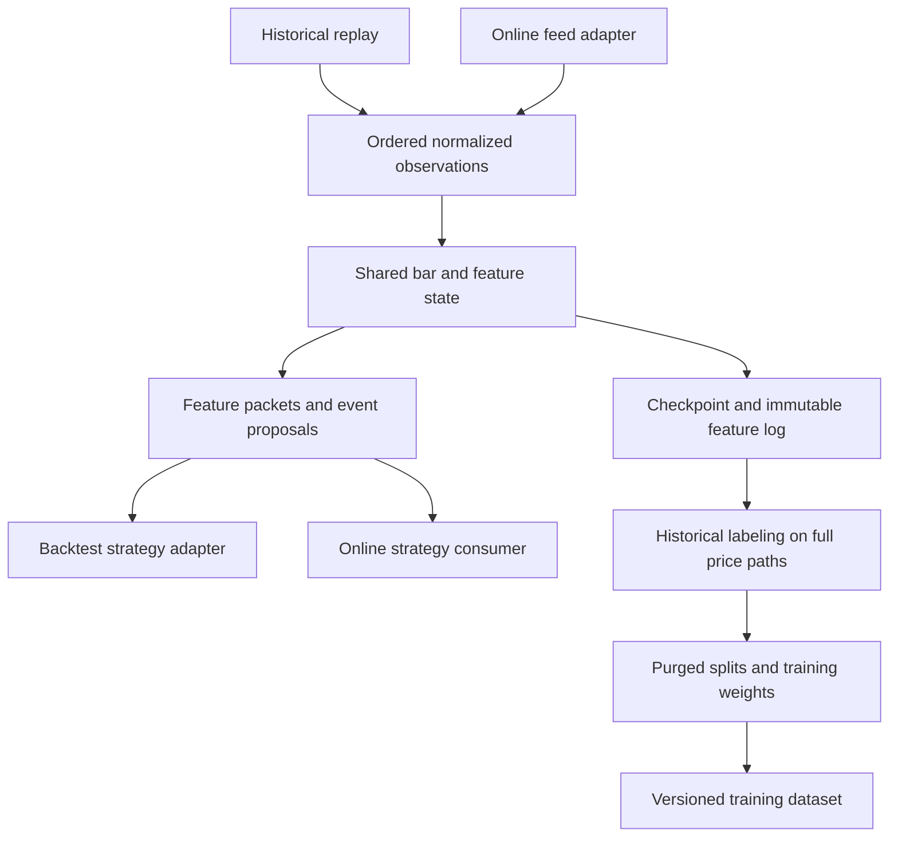

# Quant trading preprocessing prototype: implementation proposal

Status: design handoff for discussion, updated 2026-09-16. Target repository: `toy-quant`. The user has requested documentation and discussion only; this document does not authorize starting implementation. Proposed modules/APIs below do not exist yet unless explicitly identified as existing. It builds on the [AFML/cqrlib analysis](data-preprocessing-pipeline-analysis.md), including its reproduced correctness defects.

## 1. Recommended direction

Build a small Python package with **one stateful feature engine shared by historical backtests and online feature extraction**. Use Polars for historical table processing and storage, NumPy/Python state for incremental calculations, and pandas for compatibility and reference checks. Preserve a future dataset-export boundary for PyTorch model training; GPU preprocessing is outside the current scope.

Treat AFML as the source of workflows and experiments, and `cqrlib` as the source of algorithms. Preserve useful functions through adapters, but give the prototype its own explicit data contracts and corrected semantics. Do not make compatibility with known wrong results an acceptance criterion.

The first deliverable should replay historical bars through the same update API used by online input, produce identical feature packets, survive checkpoint/restart, and feed a backtest strategy without future information. Historical labeling, sample weights and purged datasets form a separate research branch. A small sklearn example is optional validation of that branch, not the central deliverable.

Confirmed scope: **spot first**, backtesting and online feature extraction, with historical input potentially **hundreds of GB**, using Binance or OKX data initially. Future implementation belongs in `toy-quant`; AFML and `cqrlib` remain reference projects. GPU work is for future model training and is deferred. Proposed defaults pending discussion: one exchange, finalized-bar feature emission, one machine and a long-or-flat strategy without borrowing. Instrument count, whether the size refers to raw trades or bars, exact input feed and latency requirements remain open.

## 2. What the pipeline produces

### Two main parts

| Part | Owns | Does not own |
|---|---|---|
| **Market-data interface** | Instrument metadata, historical downloads/REST backfill, live subscriptions, schema/unit normalization, finalization flags, source ordering/deduplication, gap reporting, raw storage and normalized replay | Feature formulas, trading signals, future-return labels or order placement |
| **Preprocessing and labeling pipeline** | Bar construction when raw trades are supplied, causal features, event sampling, historical full-path labels, weights/splits and dataset outputs | Exchange protocols, account credentials, order execution or portfolio accounting |

Part 2 has two internal paths: causal features/events usable online, and historical labels/weights that require subsequent observations. Labeling may mature later as data arrives, but it cannot be an input to an earlier trading decision. This distinction is essential even if both paths live in one Python package.

Both parts share typed contracts, manifests, quality reporting and checkpoint coordination. These are supporting modules, not additional services. A thin replay/backtest harness consumes their output to verify the demo; a complete trading system would additionally require strategy, execution and portfolio accounting, which are downstream of these two parts.

The boundary is a normalized observation stream: explicit exchange/market/instrument identity, event and availability timestamps, stable source ID/sequence, payload type and units, plus finality/quality flags. Equivalent observations from a file replay and a live adapter must be accepted by the same preprocessing API. Gap/control messages must also cross this boundary so the feature engine can suspend readiness rather than calculate across an unknown gap.

The product has two outputs: **online feature/event packets for a strategy**, and **replayable historical artifacts for backtesting and dataset construction**. It records when a feature was actually available and when a label became known. A portfolio simulator or execution engine consumes the packets through an adapter; order routing and exchange connectivity are not implemented inside the feature engine.



The diagram is logical, not a license to fit preprocessing on all data. If thresholds or transforms are learned, the relevant stages run separately within each training fold using its fitted state. Pure trailing calculations with fixed parameters may be cached across folds.

Online extraction and historical replay use the same normalization, bar state, feature updates and event selection. Online extraction never calls the future-looking labeler. The backtest adapter exposes one packet at a time according to availability, even if the full historical table is loaded in memory.

## 3. pandas versus Polars

### Proposed responsibilities

| Workload | Initial implementation | Reason |
|---|---|---|
| Scan partitioned files, select instruments/dates/columns | Polars lazy queries | Keeps large raw inputs outside the pandas compatibility layer. |
| Schema normalization, keyed joins, quality summaries | Polars expressions | Explicit keys and table operations suit this workload. |
| Standard activity bars, CUSUM, first barrier touch | NumPy arrays with simple CPU reference loops; Numba after verification | Stateful algorithms need deliberate semantics and often do not translate into ordinary table aggregation. |
| Existing indicator/FFD formulas | pandas/cqrlib reference adapters plus matching incremental implementations | Reference compatibility is useful, but rebuilding a full DataFrame on every live tick is unsuitable. |
| Online feature extraction | Per-instrument state, ring buffers, CPU numeric updates | Predictable work and persistent state shared with historical replay. |
| Offline overlap formulas | Bounded pandas adapters initially | These use historical label intervals and stay outside the live path. |
| ARIMA/ADF experiments | pandas/NumPy with statsmodels, optional | Avoid rebuilding statistical routines; fitting must respect time splits. |
| Dataset storage | Parquet plus JSON metadata | Reusable across table and tensor consumers. |
| Future model training | Exported datasets consumed by an optional PyTorch training package | No GPU backend is required in the preprocessing runtime. |

Polars has no pandas-style index and uses lazy query planning and explicit column expressions. Consequently, migration requires deliberate keyed joins and sorting, rather than replacing `pd` with `pl`. Its streaming engine processes supported queries in batches; unsupported operations may fall back to in-memory execution. Inspect query plans and peak memory instead of assuming the entire pipeline streams. [Polars migration guide](https://docs.pola.rs/user-guide/migration/pandas/), [streaming guide](https://docs.pola.rs/user-guide/concepts/streaming/).

My recommendation is to adopt Polars for the historical outer layer while retaining pandas at controlled boundaries. Online updates should use persistent state rather than run growing DataFrame queries. Polars batch streaming is not an exchange-event service with watermarks and recovery. At the checked-in sample scale, there is no measured reason for a blanket rewrite; benchmark realistic historical volumes and online update latency separately.

### Conversion policy

- Keep durable keys in columns: `instrument_id`, `bar_id`, `event_id`, and timestamps. pandas indexes are local adapter details.
- Convert a bounded, sorted instrument slice to pandas once for a group of compatible calculations, then return keyed results. Do not repeatedly convert individual columns between backends inside loops.
- A bounded slice is a memory-sized partition, not an instrument's entire history. EWM/CUSUM/bar state carries across partitions; FFD carries its trailing window. A legacy adapter that cannot preserve the required state remains a small-data reference rather than a production path.
- Send contiguous numeric arrays into kernels. Keep strings, calendars, and timestamps-as-metadata outside floating-point tensors.
- Define null/NaN handling, sorting ties, EWM adjustment, standard-deviation degrees of freedom, and window endpoints explicitly. Similar method names do not prove numerical equivalence.
- Budget conversion costs, copies, and temporary memory as part of the benchmark.

### GPU support does not decide the table stack

Polars' documented GPU engine uses RAPIDS cuDF on NVIDIA GPUs; it is not a PyTorch execution backend. The current support guide marks it Open Beta, lists limitations including user-defined functions and time-series resampling, and permits CPU fallback. This does not automatically accelerate the existing Python `cqrlib` loops. Since GPU use is intended for future model training, leave this engine out of the prototype. [Polars GPU support](https://docs.pola.rs/user-guide/gpu-support/).

## 4. Data contracts

Use UTC timestamps with declared precision, retaining the original timestamp unit in source metadata. Never infer instrument identity or timezone from a filename. For historical samples of uncertain origin, require a manifest override and preserve the uncertainty.

Resolve `instrument_id` to metadata including exchange, native symbol, `market_type`, base/quote currencies, price/quantity increments and quantity unit. The first implementation supports `market_type=spot` only. Keep market type and units explicit so future perpetuals add an adapter and accounting rules without changing feature identities. Do not implement funding, margin, leverage or liquidation for the spot demo.

| Artifact | Required identity and fields | Invariants |
|---|---|---|
| Trades | `instrument_id`, source trade ID or sequence, `event_time`, `price`, `quantity`, `quote_value`, `received_at`/`available_at` | Positive price; valid quantity; deterministic ordering by time plus source sequence; duplicates resolved by identity, not timestamp alone. |
| Bars | `instrument_id`, `bar_id`, `start_time`, `end_time`, `available_at`, OHLC, volume, quote value, trade count, `is_partial` | Completed-bar values use only its constituent trades; preserve every completed bar for labeling. |
| Features | `instrument_id`, `bar_id`, feature columns, `feature_available_at`, quality flags | No feature uses observations available after its declared availability time. |
| Events | `event_id`, instrument, signal bar, decision time, entry position/time/price, side, target, vertical endpoint | Stable identity; entry follows the declared execution convention; target fixed at decision time. |
| Labels | `event_id`, exit position/time/price, `exit_reason`, gross return, optional net return, label, `label_available_at`, `is_censored` | Labels never enter feature columns; unresolved events do not silently become zero. |
| Weights | `event_id`, `fold_id`, uniqueness, return weight, time-decay weight | Finite, nonnegative final training weights, explicit normalization and training event universe. |
| Splits | `event_id`, `fold_id`, role, exclusion reason | Label information intervals obey the split/purge policy. |
| Manifest | Source hashes, config, code/dependency revisions, fitted-state IDs, schema version, seeds, backend, quality counters | Sufficient to reconstruct the run and identify changes. |

An exchange may publish several trades at one timestamp; multiple bars can also close at one timestamp. Preserve sequence and IDs. Do not manufacture a unique timestamp by adding time offsets. Legacy `cqrlib` adapters that require unique datetime indexes must reject unsupported slices or use a separately validated positional implementation.

For bar-only inputs, `available_at=end_time` is a research assumption unless publication latency is supplied. For external features, require publication/availability time and backward as-of joins with a maximum staleness. Never forward-fill a value before its publication.

## 5. Algorithm semantics to implement

### Bars and chunk boundaries

Implement tick-count, volume, and quote-value bars. Default proposal: trades are indivisible; include the crossing trade in the current bar, then reset its activity accumulator. A large trade creates one oversized bar. Retain unfinished state across file/chunk boundaries. At the end of the requested range, either retain a marked partial bar or omit it according to configuration; exclude it from the default research dataset.

This intentionally differs from the downloader's global-cumulative-boundary behavior. Support that alternative only if it is explicitly specified and independently tested. For aggregate-trade input, `trade_count` means source records, not underlying individual executions.

Store state per instrument: partial OHLCV, activity accumulator, first/last sequence, last timestamp, and bar ordinal. Chunked and single-pass runs must produce identical completed bars. A file date boundary is not a market-session reset unless configuration says so.

### Features and event sampling

Start with log returns, fixed-fraction EMA bands, EWM-standard-deviation bands, MA-cross side, daily volatility, and fixed-width fractional differencing. Specify spans, minimum periods, adjustment mode, and gap behavior.

Compute these on full bars. Side rules emit a nullable side/event proposal; they do not delete the underlying bars. Specify how side proposals combine with CUSUM: default intersection at the same decision bar; any forward-held side requires an explicit expiry/reset policy.

Support two explicit CUSUM modes: absolute price differences with price-unit thresholds, and log-price differences with log-return-unit thresholds. Use a fixed training-calibrated threshold for the first prototype. Adaptive thresholds are an extension with a defined causal update rule, not a Series that is silently averaged.

Volatility must specify the calendar lag and historical lookup convention. The corrected default uses the last available price at or before the lag boundary; a legacy compatibility mode may preserve the strictly-before convention. Estimate it on full bars and record warm-up exclusions.

FFD must specify its input (`log_price`, `log_return`, or `cumulative_log_price`), order, weight cutoff, and resulting window length. Fixed parameters permit causal convolution; selecting order by ADF belongs inside training-only calibration. Keep expanding-window `fracDiff` for compatibility/experiments, with a clear cost limit. ARIMA residual features are optional and off by default; fit on training history and evaluate subsequent residuals with a documented update policy.

### Signals, entry and labels

Separate the signal timestamp from the entry timestamp. For the trading-oriented prototype, a signal formed at bar close enters at the next bar's open. Keep same-close entry as an explicitly optimistic AFML compatibility mode. With only OHLC bars, next-open execution is a modeling assumption; it does not account for spread, queueing, or latency.

The CPU reference labeler scans every subsequent bar close against barriers measured from the chosen entry price. A one-day vertical horizon begins at entry and resolves at the first close at/after that horizon. Calendar/session policy is instrument-specific; crypto can use elapsed UTC time.

Honor profit and stop multipliers independently. Freeze side and target at decision time. Define inclusive threshold crossing for the corrected implementation; document the legacy strict-comparison mode. At a horizontal touch exactly at the vertical endpoint, choose horizontal as the recorded reason. Persist the actual exit reason instead of inferring it from return sign.

Use `direction` labels without side and `meta` profitability labels with side. The primary signal model determines direction; the secondary model estimates whether to accept it. Keep gross-return and net-return label definitions separate. An optional explicit cost model may produce net returns, but a volatility eligibility threshold is not a transaction-cost deduction.

For the proposed spot demo, executable positions are long or flat: a bearish feature/signal means exit or stay out, not opening a short. A negative directional research label remains valid as a prediction target, but must not be confused with permission to execute a short trade. Long-side meta-labeling evaluates candidate long entries; retain short-side fixtures only for algorithm coverage and future extension.

Right-censor events whose required path is unavailable; record the reason and exclude unresolved labels from training. Close-only labels intentionally do not claim intrabar barrier detection. A later OHLC high/low mode must specify what happens when both barriers could have been touched within the same bar; OHLC alone cannot recover the order.

### Splits, weights and sampling

Implement chronological holdout and expanding walk-forward splits first, then corrected purged K-fold with embargo for AFML compatibility. These answer different evaluation questions: purged K-fold can train on later periods, while walk-forward represents past-to-future deployment.

Purge training events whose label-information intervals overlap validation/test information intervals. For pooled instruments, hold out common calendar periods across the universe. Compute exact overlap with the union of test intervals, or explicitly document a more conservative enclosing interval. Embargo means a defined time/observation interval after the test information horizon; it is not removal from the tail of the training array.

Training label ends must precede the point at which their fitted state/model is considered available. Fold-specific feature calibration uses only its training history; scalers, imputation, ARIMA, feature selection, and learned side models must be refitted accordingly. If the primary side model is learned, meta-model training needs out-of-fold primary predictions rather than in-sample predictions.

Compute concurrency and uniqueness on full-bar positions, per instrument. Build return-attribution and time-decay weights from the training event universe for each fold. Record whether decay is based on uniqueness accumulation (legacy AFML behavior) or elapsed calendar time. Keep class weights distinct. Do not drop rare labels from a test set to improve scores.

Use interval arrays and a sweep/prefix-sum calculation for concurrency where possible. Dense bar-by-event matrices remain an optional small-data diagnostic. Sequential bootstrap can initially use the tested CPU implementation on bounded samples; its adaptive draw probabilities make it a separate optimization problem.

## 6. Mapping the cqrlib functions

“Adapter” means invoke a pinned implementation on validated inputs and normalize its output. “Corrected implementation” means preserve the algorithm's intended role but explicitly version changed behavior. Golden fixtures, not historical notebook scores, decide correctness.

| Existing function family | Prototype module/API | Initial treatment |
|---|---|---|
| `dd_bars`, `dollar_bar`, `volume_bar`, `tick_bar`; downloader generator | `bars.build_standard_bars` | Corrected stateful OHLCV builder; original row samplers are not aggregated bars. |
| `bband_frac`, `bband_std`, `side_pick`, `bband_as_side` | `features.bands`, `signals.band_side` | Adapter for formulas; avoid destructive filtering and retain explicit side availability. |
| `get_ma_crossing_signals` | `signals.ma_cross` | Adapter plus tests for warm-up, equal averages, and crossing semantics. |
| `vol` | `features.volatility` | Corrected lag-boundary policy; legacy mode for differential testing. |
| `cs_filter` | `events.cusum` | Array implementation with explicit transform, scalar threshold, state, and units. |
| `getWeights`, `getWeights_FFD`, `fracDiff`, `fracDiff_FFD` | `features.fracdiff` | Reuse tested formulas; validated DataFrame adapter first, array kernels later. Helpers are available through their defining module, not necessarily top-level exports. |
| `min_value`, `plot_min_ffd`, `unit_root` | `calibration.select_ffd`, `diagnostics.stationarity` | Correct API failures; train-only search; diagnostics are separate from runtime transforms. |
| `vert_barrier`, `_pt_sl_t1`, `tri_barrier` | `labels.vertical_endpoint`, `labels.triple_barrier` | Correct full-path, endpoint, entry and asymmetry semantics. Do not wrap the defective public implementation unchanged. |
| `meta_label`, `drop_label` | `labels.assign`, `sampling.class_policy` | Explicit label mode; retain exit reasons; any rare-class policy fits on training only. |
| `num_co_events`, `wght_by_coevents`, `av_unique` | `sampling.concurrency`, `sampling.uniqueness` | Adapter/reference formulas; positional interval implementation for scale. |
| `idx_matrix`, `mp_idx_matrix` | `sampling.indicator_matrix` | Small diagnostic only; guard memory and prevent input mutation; one process initially. |
| `seq_bts`, `mp_seq_bts`, `MC_seq_bts`, `MT_MC` | `sampling.sequential_bootstrap`, `diagnostics.bootstrap` | Seeded CPU behavior; Monte Carlo comparisons optional. |
| `wght_by_rtn`, `wght_by_td` | `sampling.weights` | Fold-scoped, aligned outputs; zero-total-weight policy tested. |
| `train_times`, `embargo_times`, `PurgedKFold`, `cv_score` | `splits`, `evaluation.cross_validate` | Corrected interval logic and explicit positional selection; use sklearn estimator interfaces. |
| `BaggingClassifier` / `BaggingRegressor` | `examples.sequential_bagging` | Optional downstream demonstration, not preprocessing's internal dependency. |
| `report_matrix`, `feat_imp`, `normality`, `white_random` | `diagnostics` / example notebooks | Retain useful reporting; keep model assessment distinct from dataset construction. |
| `mp_pandas_obj`, `process_jobs`, `process_jobs_` | Execution utility, not public domain API | Do not propagate nested process pools into every stage; centralize worker budgets. |

Portfolio optimization, bet sizing, and backtest engines remain downstream extensions. Synthetic data generation remains a fixture/example facility. Those functions need not be ported to deliver the chapters 2–7 preprocessing workflow.

## 7. Package and interfaces

Implement later inside the existing `toy_quant/` package in `toy-quant`. Do not create another AFML application or relocate the current broker code merely to match an earlier draft. Keep `cqrlib` independently versioned and accessed through a narrow compatibility adapter.

Read-only inspection of `toy-quant` found these integration points:

- `toy_quant/brokers/base.py` defines account/order methods; it does not currently define a market-data feed contract.
- `toy_quant/brokers/okx/broker.py` wraps the `python-okx` SDK and exposes `get_candles`, returning the SDK's raw data payload. This is a useful starting point, not evidence of a complete historical/live feed implementation.
- `toy_quant/brokers/okx/models.py` has an `OKXCandle` model with OHLCV and a timestamp. The new normalized contract needs instrument identity, units, finality, availability and provenance beyond these fields.
- `toy_quant/storage/base.py` is oriented to orders, fills and balance snapshots. Bulk market-data Parquet storage should be a separate concern; it need not replace the existing store.
- Existing `docs/system-architecture.md` describes lower-level client/service modules that do not match the currently inspected SDK-wrapper structure. Reconcile that document against code when implementation begins; do not assume every described module exists.

Propose a dedicated `MarketDataSource` protocol alongside `BaseBroker`. Public market-data ingestion must not require constructing an account/order broker. Reuse appropriate SDK/utilities through composition after reviewing their behavior. The existing broker remains the future execution integration point; no broker changes are requested in this handoff.

```text
toy_quant/
  brokers/                # existing account/order integration
  storage/                # existing order/fill/balance stores
  contracts/              # proposed normalized observations and feature packets
  market_data/            # part 1
    base.py               # source protocol and capability declarations
    okx.py                # proposed historical/live data adapter
    binance.py            # later alternative; choose one exchange first
    replay.py             # availability-ordered historical source
    parquet.py            # bulk market-data files and manifests
  preprocessing/          # part 2
    pipeline.py           # explicit stage orchestration
    bars/                 # stateful standard-bar builder
    features/             # causal transforms and fitted parameter state
    signals/              # band/MA side rules
    events/               # CUSUM and event construction
    labels/               # historical full-path barriers and targets
    sampling/             # interval weights and bootstrap
    splits/               # walk-forward, purge and embargo
    adapters/cqrlib.py    # legacy reference boundary
    runtime/              # incremental updates and checkpoint state
    datasets/             # aligned research outputs; future tensor export
  integration/backtest.py # proposed thin consumer/harness adapter
configs/                  # concrete experiment settings
tests/                    # semantic fixtures and integration checks
benchmarks/               # same-input backend comparisons
```

Use plain typed functions/dataclasses initially. Avoid introducing a general DAG engine, distributed scheduler, plugin registry, or separate service for each step.

Proposed interface sketch (not executable until implemented):

```python
parameters = calibrate(training_history, spec)  # fit cutoff is recorded
engine = FeatureEngine(spec, parameters, checkpoint=checkpoint)
for observation in source:  # historical replay or online normalized input
    for packet in engine.update(observation):
        consumer.on_features(packet)  # backtest adapter or online consumer
engine.snapshot(checkpoint_store)
```

For cross-validation, repeat calibration and replay with the appropriate training state. Maintain two distinct states: immutable fitted parameters (training cutoff and version) and evolving runtime state (buffers, accumulators, source offsets). Restoring one without the other is invalid. Historical labeling runs separately against full bars and the recorded decisions.

Kernel interfaces accept per-instrument numeric arrays plus integer offsets, e.g. close prices, entry positions, terminal positions, target and side. Return exit positions and reason codes; the table layer restores IDs/timestamps. Every returned row has a stable key, so sorting or parallel completion cannot silently misalign labels and features.

Persist a run directory with `manifest.json`, normalized bars, features, events, labels, fold assignments, fold weights, fitted state, and `quality.json`. Data can be partitioned by instrument and date; run identity includes source hashes, code/config versions and semantic mode. Publish the final manifest only after output validation succeeds. Cache fold-dependent artifacts with their fitted-state ID.

### Shared online and backtest runtime

The key abstraction is `update(observation) -> zero or more packets`. Historical batches are an input-delivery optimization: they must preserve the same ordered state transitions. Any later vectorized replay shortcut needs parity tests against this update engine.

| State | Persisted content | Update contract |
|---|---|---|
| Input ordering | Source partition/offset, last sequence, watermark, recent deduplication IDs | Never deduplicate on timestamp alone; preserve deterministic ties. |
| Bar builder | Partial OHLCV, activity accumulator, first/last trade, bar ordinal | Finalize according to the declared threshold and late-data policy. |
| EMA/bands | Weighted sums/counts or equivalent stable moments | Match configured adjustment and variance semantics exactly. Reinitializing from a short window is not equivalent. |
| Volatility | Lag-price lookup buffer, return-moment state | Retain enough time history for the calendar lag and session gaps. |
| FFD | Fixed coefficients and trailing observations | Emit only after warm-up; bounded memory proportional to window length. |
| CUSUM/side | Positive/negative sums, prior value, side-rule state | Preserve state across file, chunk and process-restart boundaries. |
| Output | Packet sequence, committed source offset, parameter/state versions | Stable output IDs support idempotent recovery. |

Each feature packet includes instrument/bar identity, event time, actual availability/emission time, source sequence, feature order/version, values, validity/warm-up flags and any side/event proposal. Emit features on every finalized bar by default; event sampling controls strategy proposals, not whether the underlying feature history exists.

For a feed with out-of-order events, configure a bounded reorder buffer and lateness allowance. A watermark establishes what can be finalized. For a finalized-bar feed, honor its explicit final flag or a documented finalization rule. Proposed first policy: quarantine observations arriving after finalization and record them; never silently rewrite already-published features or past trading decisions. Retrospective correction may create a new historical dataset version. Idle-instrument watermark behavior and feed gaps must be explicit, not guessed from wall-clock time.

Record both event and receive times online. Backtests intended to reproduce live behavior replay arrival order, buffering and actual feature availability. Legacy files containing event time alone use an explicit idealized arrival assumption and cannot reproduce historical feed latency. A strategy can only react after the feature packet is available; its simulated entry must follow that time. “Next bar open” is admissible only when the assumed timing actually allows it. Feature parity alone does not prove realistic fills.

Use one ordered state owner per instrument; different instruments can run independently. Cross-instrument features require a separate as-of synchronization rule, so they are deferred from the first slice. Bound input queues; when overloaded, pause/replay from durable input or mark a gap and suspend valid output. Do not silently drop observations and continue as though state is correct.

A checkpoint contains fitted-parameter identity, all runtime states, source offsets, schema/code versions and last committed packet identity. Use a durable append log plus checkpoint/output coordination or an outbox protocol: replay after a crash may recompute a packet, but the sink must deduplicate its stable ID. Merely saving Python objects periodically does not provide exactly-once observable output. Reject incompatible checkpoints or migrate them explicitly. Warm up from sufficient history before marking features ready.

Backtest integration supplies a simulated availability clock and a packet callback. Start with a small recording strategy harness and add an adapter to the chosen backtest engine. Labels, future returns and full-horizon price arrays stay out of that strategy callback. Persist the feature packets used by a run so any decision can be audited.

### Historical execution at hundreds of GB

Design for bounded working memory from the first implementation; total history size must not determine RAM usage for the incremental stages.

1. Normalize source files into immutable Parquet partitions with an explicit schema, instrument/time bounds and hashes. Partition by date and instrument or instrument bucket depending on cardinality; compact tiny files and measure useful row-group/file sizes rather than hardcoding one universal size.
2. Use lazy scans with column/date/instrument selection pushed into the query. Write partitioned outputs incrementally. Do not call a whole-history `collect()` and then convert it to pandas. Verify the physical query plan and memory behavior; a streaming query can still contain operations that materialize data.
3. Establish deterministic ordering during ingestion. Arbitrarily unsorted hundreds-of-GB inputs need external sorting or partitioned sorted runs plus a merge, not a global in-memory sort. Replay sorted chunks in order and checkpoint state at committed partition boundaries.
4. Set explicit per-worker working-memory and queue limits. Tune row batches from measured decoded size and temporary-array overhead; compressed file size is not the memory footprint. Bound concurrency so parallel instruments do not multiply memory beyond the machine budget.
5. Historical barrier labeling reads the full-resolution path for each event's finite horizon, but need not hold the full history. Process entry blocks with a future halo, or maintain pending events until expiry. The horizon and calendar-gap policy bound pending work. Never truncate a label at a storage partition boundary. Write finished events incrementally.
6. Concurrency calculations carry intervals active at the partition boundary. Store entry/exit positions and sweep interval endpoints; avoid allocating a history-wide bars × events matrix. Dense sequential-bootstrap diagnostics must have explicit sample limits at this scale.
7. Replay feature state sequentially through time within an instrument. Parallelize independent instruments first. Time-partition parallelism is allowed only with verified initial state/halo handling; resetting EMA or CUSUM at each date produces a different pipeline.
8. Cache immutable bars and fixed-parameter causal features. Cache calibrated outputs by fitted-state/fold identity. Emit row counts, exclusion reasons, throughput and memory metrics per stage so a slow or lossy partition is visible.

A single-machine CPU implementation is a reasonable starting architecture, not a claim that any single machine meets the unknown replay deadline. Instrument count, storage bandwidth, feature count, horizon density and actual RAM determine feasibility. Add distributed scheduling only if profiling shows the bounded single-machine design cannot meet a defined target. No benchmark has yet been run on hundreds of GB.

## 8. Future model-training boundary

Defer GPU kernels and device orchestration. The present requirement is that a future training package can consume feature arrays, labels, weights, masks, event IDs and fold assignments without changing feature definitions.

Export either tabular samples or lookback sequences ending at the decision timestamp. Store feature order, dtype, fitted-transform version and train/validation/test membership. Keep price and label calculations in float64 and timestamps/positions as integers; a future trainer may cast model inputs independently.

Polars offers `to_torch`, but currently documents that interface as unstable. Keep conversion behind a dataset adapter and pin/test the chosen path when model training is introduced. It is not a reason to select Polars or pandas for online extraction. [Polars tensor export](https://docs.pola.rs/api/python/stable/reference/dataframe/api/polars.DataFrame.to_torch.html).

## 9. Implementation milestones

| Milestone | Deliverable | Acceptance |
|---|---|---|
| M0: semantics and fixtures | Schemas, availability/ordering rules, bar and feature expectations | Every expected packet and exclusion is explainable. |
| M1: shared bar-input engine | Existing bars replayed through incremental returns, EMA/bands, volatility, FFD and CUSUM; packet sink | One-by-one and chunked replay yield the same features/events; no future reads. |
| M2: backtest and online integration | Replay clock, backtest adapter, normalized online-input adapter, checkpoints and durable packet IDs | Identical recorded inputs yield identical packets; restart produces no observable duplicates or lost packets under the tested sink protocol. |
| M3: research branch and AFML coverage | Correct full-path labels, splits, weights, bootstrap and compatibility diagnostics | Regression fixtures pass; training intervals and fitted state respect time boundaries. |
| M4: trade-input support and CPU scaling | Correct stateful activity bars, Polars historical input, bounded queues, performance report | Chunk invariance, bounded memory and documented latency/backpressure behavior. |
| Future: model training | Dataset export adapter and optional PyTorch trainer | Training consumes the same versioned feature definitions; outside current scope. |

M1 starts with finalized bars so replay/live parity can be proven before adding raw-trade ordering complexity. M2's online adapter contract can initially be tested by a recorded event stream; a real feed connector depends on the selected source. Offline replay alone is not evidence that a real feed connection has been validated. The legacy and newer samples remain separate fixtures.

No exact time or speedup estimate is justified until workload and hardware are known. First benchmark three regimes: checked-in samples for iteration, a representative multi-instrument bar dataset, and raw trades large enough to stress RAM. Measure median/repeated wall time, peak RSS, historical rows/events per second, online p50/p95/p99 update latency, conversion time, output identity, and cold versus warmed compilation. Keep the data, semantic settings and seeds fixed while changing one backend at a time.

## 10. Verification requirements

- **Bars:** oversized trades, exact threshold hits, partial tails, repeated timestamps, out-of-order input, duplicate source IDs, and chunk-boundary equivalence.
- **Causality:** modifying observations after a decision cannot change already-available features or event decisions under the same trained state. Labels may change until their exit is observed.
- **Replay/online parity:** one-by-one delivery, random batch sizes and restart replay produce the same packet IDs, feature values, validity flags and events under identical ordered input. Test delayed arrivals, duplicate delivery, idle instruments and feed gaps against the declared policy.
- **Recovery:** inject crashes around source consumption, output commit and checkpoint writes; assert observable packet uniqueness and complete recovery. A changed config/state version cannot silently resume an incompatible checkpoint.
- **Scale:** run a representative large-data replay under a fixed RAM budget; record peak memory, throughput and queue depth. Test labeling and active-interval handling across partition boundaries. A passing tiny fixture does not establish hundred-GB capacity.
- **Labels:** missed inter-event touches, independent asymmetric barriers, long/short returns, exact touches, vertical ties, execution lag, censoring, and no cross-instrument paths.
- **Alignment:** output row order changes cannot associate a feature with another event's label/weight; joins have validated cardinality.
- **Splits:** randomized interval fixtures verify overlap exclusion, embargo position and chronological fit cutoffs. Pooled instruments use consistent calendar holdouts.
- **Weights:** compare efficient interval calculations to a tiny dense oracle; test no overlap, full overlap, zero returns and deterministic seeded bootstrap.
- **Backends:** compare against hand-computed fixtures and the corrected CPU reference. Existing `cqrlib` output is an additional differential signal, not the oracle where a defect is known.
- **Quality reporting:** count rows excluded for schema violations, warm-up, absent sides, target thresholds, missing future coverage, feature gaps and purging separately.

## 11. Decisions to discuss

Backtesting and online feature extraction are confirmed. The remaining choices with the largest design impact are:

- **First exchange?** Existing OKX integration makes OKX a candidate for the first adapter; Binance remains an alternative. One adapter should establish the contract before building the second.
- **Finalized bars or every trade as the initial input?** I recommend finalized bars first; the engine can add stateful trade-to-bar construction in the next stage.
- **Required latency and universe size?** History may be hundreds of GB; whether that is trades or bars and how many active instruments it covers still matter. A bar-close strategy over tens of instruments has different constraints from per-trade extraction across thousands. Measure before adding concurrency infrastructure.
- **Historical receive-time data available?** Without it, backtests can reproduce event-time calculations but cannot fully reproduce live arrival delays, late events or feed outages.
- **Backtest consumer?** An existing engine requires a thin packet adapter; otherwise a small replay strategy harness can establish the interface before a full portfolio simulator.

The practical first slice is historical bars → shared incremental feature engine → feature/event packets → backtest harness and recorded-online replay. Add persistence/recovery, historical labels and AFML weighting around that same engine. Polars handles historical data efficiently; pandas helps verify the inherited formulas; neither should determine the live state model.

## 12. Proposed agent implementation workflow

This is a proposed workflow for the later coding task, not a request to start agents now. Delegate bounded implementations after agreeing the shared schema, semantics and fixtures. The lead agent owns architecture, task boundaries, integration, code review and end-to-end acceptance. Checking only subagent summaries is insufficient.

| Work package | Possible owner | Dependency and evidence |
|---|---|---|
| Shared contracts and tiny reference flow | Lead agent | Establish input/output examples and error/finality rules first. |
| First exchange adapter and replay input | Subagent A | Frozen observation contract; recorded payload fixtures, unit/timestamp/finality tests and gap behavior. |
| Incremental feature/event kernels | Subagent B | Frozen bar/packet contract; hand-calculated values, causality, chunk and restart parity. |
| Historical labeler and interval weights | Separate bounded task after event schema is stable | Full-path fixtures, exit reasons, censoring and alignment checks. |
| Independent review | Available reviewer or lead | Examine leakage, boundaries, recovery and legacy behavior; report reproducible issues. |
| Integration and delivery | Lead agent | Review actual diffs, run relevant tests, then verify adapter → features → labels/replay together. |

Do not start all work packages simultaneously. Two independent implementation tasks are a reasonable first parallel batch; tightly coupled contract changes stay coordinated. Give each task explicit owned files, allowed dependencies, non-goals, acceptance cases and the relevant source-analysis sections. Use isolated branches/worktrees when appropriate; otherwise enforce non-overlapping edits. Require each handoff to name changes, tests run and remaining limitations.

The lead resolves conflicting assumptions and requests fixes before accepting work. Subagent tests are evidence, not proof that the integrated system works. Add independent small oracles for financially meaningful behavior so implementations and tests cannot merely repeat the same mistaken assumption. Model choice can vary by task and available tooling; it does not replace these review gates.

Official OpenAI guidance supports specifying when/how to delegate and making testing expectations explicit; the ownership and review plan here is our project recommendation. [OpenAI guidance on subagent delegation](https://developers.openai.com/api/docs/guides/latest-model#subagent-delegation).

## 13. Handoff to toy-quant

Move or copy these two documents together into `toy-quant/docs/` when ready:

- `quant-preprocessing-prototype-design.md`: forward design, scope, interfaces and proposed work packages.
- `data-preprocessing-pipeline-analysis.md`: source findings, failure examples and measured labeling differences.

The analysis's AFML source links assume AFML remains a sibling checkout; they are evidence links, not runtime dependencies. Adapt them if repository layout changes. Do not copy all sample data or `cqrlib` source into the demo by default. Later implementation should declare dependencies and bring only explicitly selected, provenance-recorded fixtures.

Before coding in `toy-quant`, read its own repository instructions, inspect its current working changes and `.python-version`, and reconcile this proposal with its existing architecture document. AFML's environment notes do not automatically govern that repository. The current handoff changes documentation only and leaves moving files to the user.
